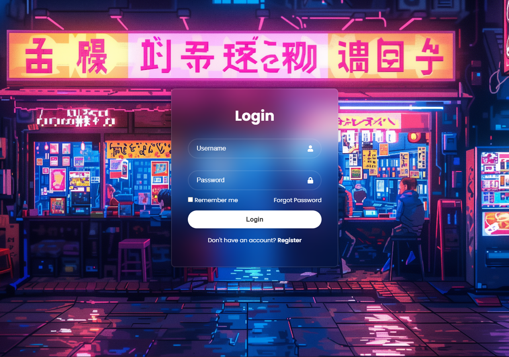
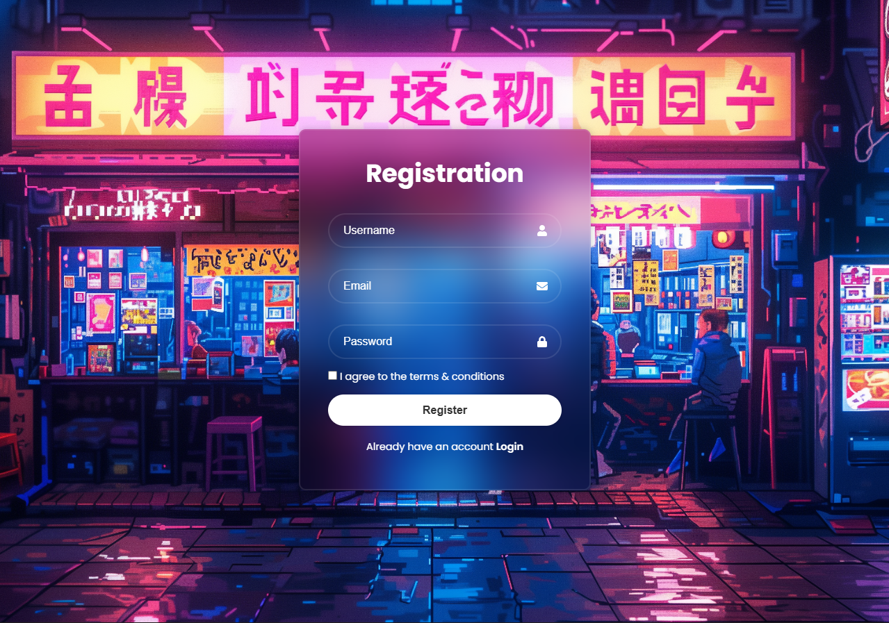

# 🧪 Login Lab

**Login Lab** es un entorno fullstack de práctica para explorar cómo funcionan los sistemas de inicio de sesión en aplicaciones web.  
No es un producto final, sino un **playground de autenticación**: un espacio seguro para experimentar.  

---

## 🎯 Objetivo
- Comprender los conceptos básicos de **login y autenticación**.  
- Practicar el manejo de sesiones, cookies y tokens.  
- Experimentar con opciones como **“Remember me”** y **Aceptación de términos**.  
- Servir como base para integrar funciones más avanzadas (registro, roles, OAuth, etc.).  

---

## 🧩 Qué incluye
- Un **formulario de login simple** con email y contraseña.  
- Checkbox de **“Remember me”** para sesiones extendidas.  
- Ejemplo de **manejo de errores** y validaciones mínimas.  
- Endpoint de **registro** con aceptación de términos y condiciones.  
- API backend con rutas `/login` y `/register`.  
- Estructura modular lista para extender.  

---

## 🚀 Cómo usarlo

0. Instalación de PostgreSQL


1. Clona este repositorio:  
```bash
git clone https://github.com/To-oDev/LoginLab.git
```

2. Instala dependencias

```bash
# client
cd client
npm install

# server
cd server
# crea y carga un entorno virtual
python -m venv venv
venv/Scripts/activate
# instala dependencias listadas en requirements.txt
pip install -r requirements.txt
```

3. Inicia servidores locales

```bash
# (venv) LOGINLAB/server>
uvicorn app.main:app --reload

# client>
npm run dev
```
Abre el frontend en tu navegador e "inicia sesión". Tu token de sesión será almacenado (por ahora) en local storage.

> Es recomendable no guardar tokens de sesión en local storage. En su lugar utiliza Secure Cookies.

## 🛠️ Ideal para

- Aprender los fundamentos de autenticación.
- Desarrollar un sandbox para probar ideas rápidas.
- Experimentar con login.

## ⚠️ Importante

No usar en producción: este proyecto es explorativo.

## 🖥️ Vista previa

